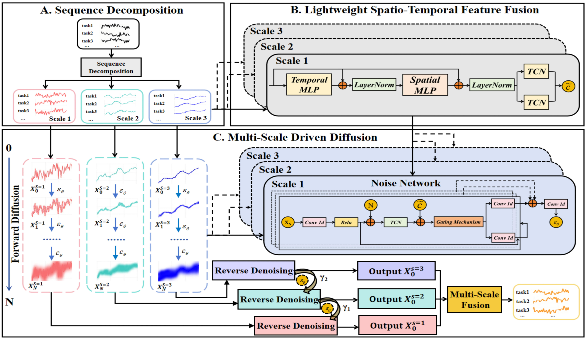
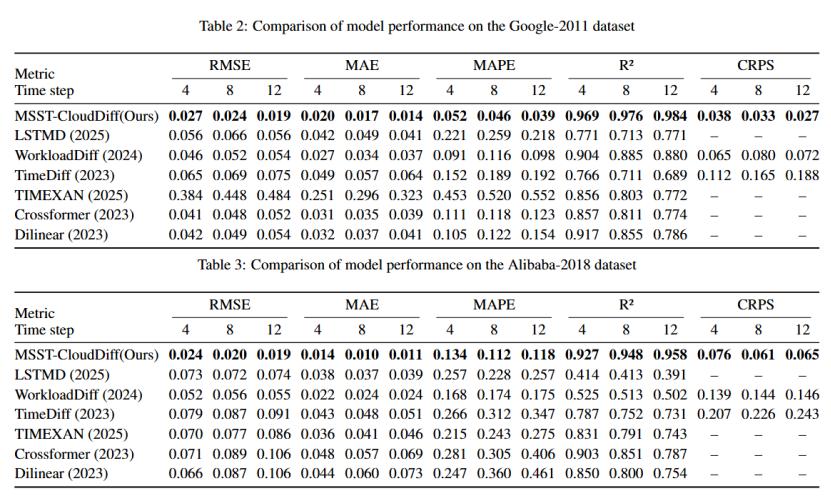

# Multi-Scale Spatio-Temporal Diffusion Model for Cloud Workload


**Abstract:**Influenced by multiple external factors, cloud workload sequences exhibit intertwined characteristics of randomness, periodicity, and multi-scale complexity, which pose significant challenges to high-accuracy prediction. Diffusion models have demonstrated exceptional capability in modeling complex data distributions and generating high-quality samples in recent years, making them highly compatible with the inherent stochasticity of cloud workload sequences. However, existing diffusion-based time series prediction studies still lag in capturing diverse features ranging from long-term growth trends to short-term rapid fluctuations during the generation process of diffusion. To address this issue, this paper proposes a Multi-Scale driven Spatio-Temporal Diffusion model for Cloud workload forecasting (MSST-CloudDiff). MSST-CloudDiff introduces a multi-scale design and develops a hierarchically fused mechanism in both the forward diffusion and reverse denoising processes, enabling progressive generation from large scale trends to fine-grained details. In addition, MSST-CloudDiff employs a lightweight spatio-temporal feature fusion to generate conditional vectors to precisely guide noise estimation and denoising directions at each diffusion step. Extensive experiments on Google-2011 and Alibaba-2018 datasets demonstrate that MSST-CloudDiff significantly outperforms state-of-the-art methods in terms of prediction accuracy and stochastic modeling capability, fully validating its effectiveness in complex, non-stationary cloud workload scenarios.

##model 
<div align=center>



</div>

# Main Results
<div align=center>



</div>


## Prerequisites


Dependencies can be installed using the following command:


```shell
pip install -r requirements
```

## Usage


**Training and forecasting for the workload dataset.**

```shell
python main.py 
```

## Dataset Preparation
We use two public datasets:

1.**google dataset**   https://github.com/google/cluster-data/blob/master/Clus
terData2019.md  
2.**alibaba dataset**   https://github.com/alibaba/clusterdata/tree/v2018/cluster-trace-v2018


## Acknowledgement

We are grateful for the valuable codes in the following GitHub repositories, which have been instrumental in achieving our baseline results.
[LSTMD](https://github.com/andreareds/TowardsUncertaintyAwareWorkloadPrediction)
[Workloaddiff](https://github.com/Ak2714/WorkloadDiff)
[TimeDiff](https://github.com/MuhangTian/TimeDiff)
[TIMEKAN](https://github.com/huangst21/TimeKAN)
[Crossformer](https://github.com/thuml/Time-Series-Library)
[Dlinear](https://github.com/thuml/Time-Series-Library)


## Citation

